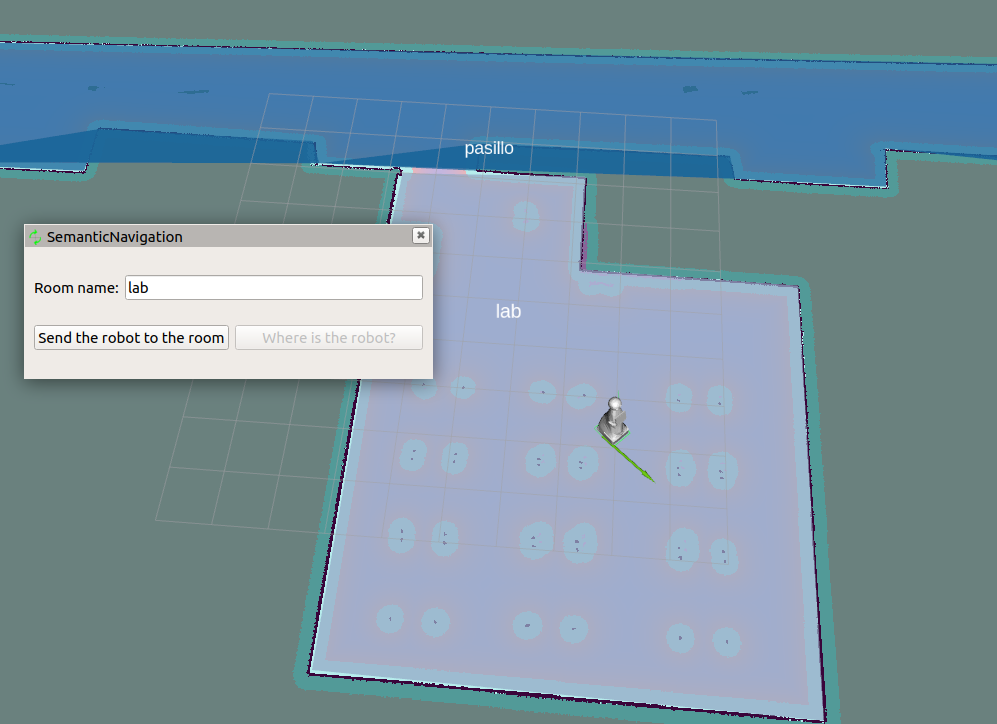

# semantic_navigation


[](https://opensource.org/licenses/Apache-2.0)
[](https://github.com/grupo-avispa/semantic_navigation/actions/workflows/build.yml)
[](https://codecov.io/gh/grupo-avispa/semantic_navigation)

## Overview

A ROS metapackage for semantic navigation. At the moment the included packages are:

 * [semantic_navigation_bt]: behavior tree for semantic navigation.
 * [semantic_navigation_msgs]: messages used by the semantic navigation packages.
 * [semantic_navigation_rviz_plugins]: [Rviz2] panel plugin to easily create regions and to send the robot to them.
 * [semantic_navigation_tasks]: used to generate random navigation goals and semantic position services.


*Robot navigating from room to room with SemanticPanel in the side*

**Keywords:** ROS2, navigation, semantic

### License

**Author: Alberto Tudela<br />**

The semantic_navigation package has been tested under [ROS2] Rolling on [Ubuntu] 24.04. This is research code, expect that it changes often and any fitness for a particular purpose is disclaimed.

## Installation

### Building from Source

#### Dependencies

- [Robot Operating System (ROS) 2](https://docs.ros.org/en/jazzy/) (middleware for robotics),
- [polygon_ros](https://github.com/MetroRobots/polygon_ros/) (Polygon visualization)

#### Building

To build from source, clone the latest version from the main repository into your colcon workspace and compile the package using
```bash
cd colcon_workspace/src
git clone https://gitlab.com/grupo-avispa/ros/semantic_navigation.git
cd ../
rosdep install -i --from-path src --rosdistro jazzy -y
colcon build --symlink-install
```

[Ubuntu]: https://ubuntu.com/
[ROS2]: https://docs.ros.org/en/jazzy/
[Rviz2]: https://github.com/ros2/rviz
[semantic_navigation_bt]: ./semantic_navigation_bt
[semantic_navigation_msgs]: ./semantic_navigation_msgs
[semantic_navigation_rviz_plugins]: ./semantic_navigation_rviz_plugins
[semantic_navigation_tasks]: ./semantic_navigation_tasks